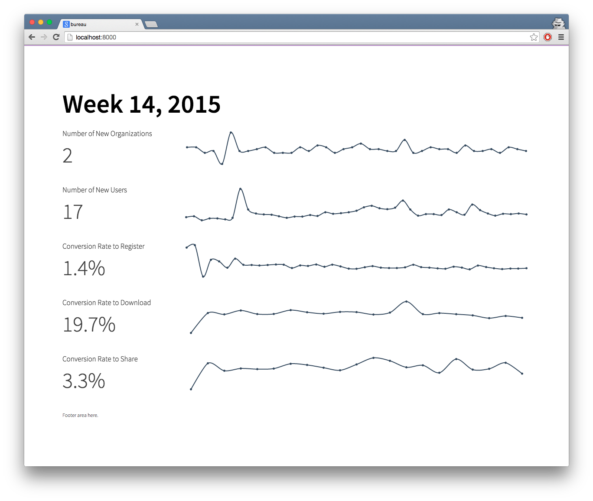

## Bureau: HDX's Information Dashboard
  

Bureau is a simple application created to collect and display statistics about the performance of the [Humanitarian Exchange Project](http://hdx.rwlabs.org).

