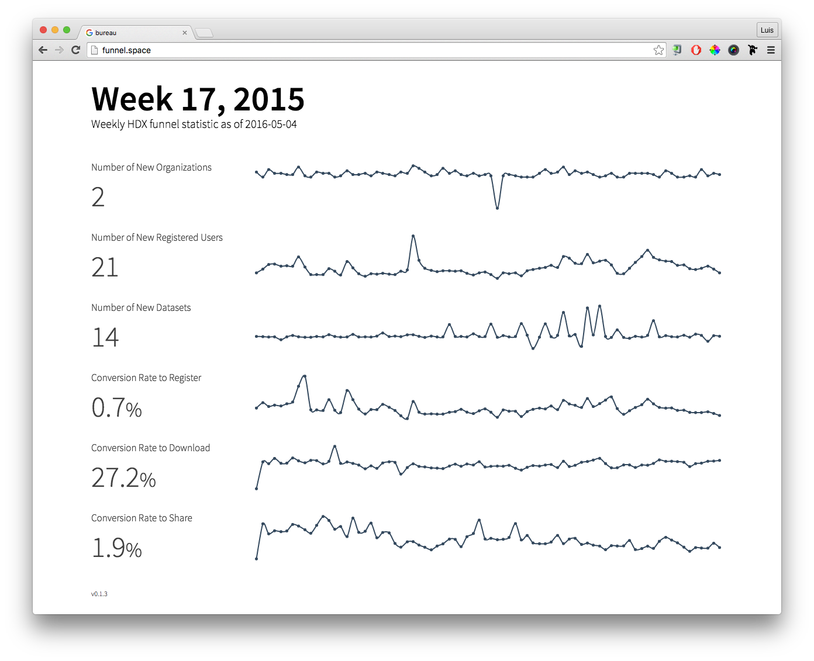

## Funnel Stats
[](https://travis-ci.org/luiscape/bureau) [](https://coveralls.io/r/luiscape/bureau) [](http://waffle.io/luiscape/bureau)


Funnel Stats is a simple application created to collect and display statistics about the performance of the [Humanitarian Exchange Project](http://hdx.rwlabs.org).




## Using Dockerfile
A local `/secrets` directory should be mounted as a volume when running the Dockerfile. That directory should contain two Google-provided files that authenticate the application with Google Analytics: `application-email-address.txt` and `application-private-key.p12`. Assuming those files are correctly mounted in the container, the following command should start a Docker container successfully:

```shell
$ docker run --name funnel_stats \
    -p 7000:7000 \
    -v "$(pwd)"/secrets:/hdx-monitor-funnel-stats/secrets \
    -d luiscape/hdx-monitor-funnel-stats:v0.1.4
```
